# Company OS — Schema Diagram

This document provides a visual representation of the database schemas and their relationships in Company OS.

## Entity Relationship Diagram (Mermaid)

```mermaid
erDiagram
    %% Core Schema - Foundation
    auth_users ||--|| core_profiles : "1:1"
    core_profiles }o--|| core_departments : "belongs to"
    core_profiles ||--o{ core_employees : "has"
    core_contacts ||--o{ core_company_contacts : "linked via"
    core_companies ||--o{ core_company_contacts : "linked via"
    
    core_roles ||--o{ core_user_role_bindings : "assigned to"
    auth_users ||--o{ core_user_role_bindings : "has"
    core_permissions ||--o{ core_role_permissions : "granted via"
    core_roles ||--o{ core_role_permissions : "has"
    
    core_teams ||--o{ common_util_subscriptions : "owns"
    
    %% CRM Schema
    core_contacts ||--o{ crm_leads : "contact"
    core_companies ||--o{ crm_leads : "company"
    core_profiles ||--o{ crm_leads : "owner"
    crm_leads ||--o{ crm_interactions : "has many"
    crm_leads ||--o{ crm_status_history : "has many"
    crm_leads ||--o{ crm_opportunities : "has"
    crm_pipelines ||--o{ crm_stages : "has many"
    crm_stages ||--o{ crm_opportunities : "has many"
    
    %% ATS Schema
    core_contacts ||--o{ ats_candidates : "is"
    ats_candidates ||--o{ ats_applications : "has many"
    ats_applications ||--o{ ats_interviews : "has many"
    ats_interviews ||--o{ ats_evaluations : "has"
    
    %% Ops Schema
    core_contacts ||--o{ ops_orders : "account"
    core_profiles ||--o{ ops_orders : "owner"
    ops_orders ||--o{ ops_order_items : "has many"
    ops_orders ||--o{ ops_shipments : "has many"
    ops_orders ||--o{ ops_quotations : "has many"
    ops_orders ||--o{ ops_order_quotations : "many-to-many"
    ops_quotations ||--o{ ops_order_quotations : "many-to-many"
    ops_orders ||--o{ ops_payments : "has many"
    ops_orders ||--o{ ops_order_status_history : "has many"
    ops_quotations ||--o{ ops_quotation_status_history : "has many"
    ops_quotations ||--o| ops_shipments : "may spawn"
    ops_shipments ||--o{ ops_shipment_status_history : "has many"
    core_contacts ||--o{ ops_quotations : "source_party"
    core_contacts ||--o{ ops_quotations : "target_party"
    core_contacts ||--o{ ops_shipments : "from_party"
    core_contacts ||--o{ ops_shipments : "to_party"
    
    %% Common Util Schema
    common_util_tasks ||--o{ common_util_task_assignees : "has many"
    common_util_sops ||--o{ common_util_files : "has many"
    
    %% Import Ops Schema
    import_ops_inquiries ||--o{ import_ops_rfqs : "has many"
    import_ops_rfqs ||--o{ import_ops_quotes : "has many"
    import_ops_quotes ||--o| ops_orders : "may become"
    
    %% Global Audit Log
    core_activity_events }o--|| core_contacts : "entity (polymorphic)"
    core_activity_events }o--|| ops_orders : "entity (polymorphic)"
    
    %% Entity Definitions
    auth_users {
        uuid id PK
        string email
        timestamp created_at
    }
    
    core_profiles {
        uuid id PK
        uuid user_id FK
        uuid department_id FK
        string first_name
        string last_name
        timestamp created_at
        timestamp updated_at
        timestamp deleted_at
    }
    
    core_departments {
        uuid id PK
        string name
        timestamp created_at
        timestamp updated_at
        timestamp deleted_at
    }
    
    core_employees {
        uuid id PK
        uuid profile_id FK
        timestamp created_at
        timestamp updated_at
        timestamp deleted_at
    }
    
    core_contacts {
        uuid id PK
        string name
        string email
        string phone
        timestamp created_at
        timestamp updated_at
        uuid created_by FK
        timestamp deleted_at
    }
    
    core_companies {
        uuid id PK
        string name
        timestamp created_at
        timestamp updated_at
        uuid created_by FK
        timestamp deleted_at
    }
    
    core_company_contacts {
        uuid id PK
        uuid company_id FK
        uuid contact_id FK
        timestamp created_at
    }
    
    core_roles {
        uuid id PK
        string name
        string description
        timestamp created_at
        timestamp updated_at
    }
    
    core_permissions {
        uuid id PK
        string name
        string resource
        string action
        timestamp created_at
    }
    
    core_role_permissions {
        uuid id PK
        uuid role_id FK
        uuid permission_id FK
        timestamp created_at
    }
    
    core_user_role_bindings {
        uuid id PK
        uuid user_id FK
        uuid role_id FK
        timestamp created_at
    }
    
    core_teams {
        uuid id PK
        string name
        timestamp created_at
        timestamp updated_at
        timestamp deleted_at
    }
    
    core_activity_events {
        uuid id PK
        string entity_type
        uuid entity_id
        string action
        jsonb metadata
        uuid created_by FK
        timestamp created_at
    }
    
    core_enum_registry {
        uuid id PK
        string category "quotation_type, shipment_type, vertical"
        string key "factory, freight, import"
        string label "Factory Purchase, Freight Forwarding"
        int order_no
        timestamp created_at
        timestamp updated_at
    }
    
    crm_leads {
        uuid id PK
        uuid contact_id FK
        uuid company_id FK
        uuid owner_id FK
        string status
        timestamp created_at
        timestamp updated_at
        uuid created_by FK
        timestamp deleted_at
    }
    
    crm_opportunities {
        uuid id PK
        uuid lead_id FK
        uuid pipeline_id FK
        uuid stage_id FK
        timestamp created_at
        timestamp updated_at
        timestamp deleted_at
    }
    
    crm_interactions {
        uuid id PK
        string entity_type
        uuid entity_id
        string type
        text notes
        timestamp created_at
        uuid created_by FK
        timestamp deleted_at
    }
    
    crm_pipelines {
        uuid id PK
        string name
        timestamp created_at
        timestamp updated_at
        timestamp deleted_at
    }
    
    crm_stages {
        uuid id PK
        uuid pipeline_id FK
        string name
        int order
        timestamp created_at
        timestamp updated_at
    }
    
    crm_status_history {
        uuid id PK
        uuid lead_id FK
        string status
        timestamp created_at
        uuid created_by FK
    }
    
    ats_candidates {
        uuid id PK
        uuid contact_id FK
        timestamp created_at
        timestamp updated_at
        timestamp deleted_at
    }
    
    ats_applications {
        uuid id PK
        uuid contact_id FK
        uuid job_id FK
        string source
        timestamp created_at
        timestamp updated_at
        timestamp deleted_at
    }
    
    ats_interviews {
        uuid id PK
        uuid application_id FK
        timestamp scheduled_at
        timestamp created_at
        timestamp updated_at
        timestamp deleted_at
    }
    
    ats_evaluations {
        uuid id PK
        uuid interview_id FK
        jsonb scores
        text notes
        timestamp created_at
        timestamp updated_at
    }
    
    ops_orders {
        uuid id PK
        uuid account_id FK
        uuid owner_id FK
        string vertical_key
        string status
        timestamp created_at
        timestamp updated_at
        uuid created_by FK
        timestamp deleted_at
    }
    
    ops_order_items {
        uuid id PK
        uuid order_id FK
        string sku
        int quantity
        decimal price
        timestamp created_at
        timestamp updated_at
        timestamp deleted_at
    }
    
    ops_quotations {
        uuid id PK
        enum quotation_type "factory|freight|client|warehouse"
        uuid source_party_id FK
        uuid target_party_id FK
        uuid order_id FK "nullable"
        enum related_entity_type "product|shipment|service|import_request"
        uuid related_entity_id "polymorphic"
        string currency
        decimal amount
        jsonb tax_jsonb
        text terms
        text[] files
        enum status "draft|sent|approved|rejected|expired"
        string vertical_key
        jsonb meta "weight, duration, incoterm, etc"
        timestamp created_at
        timestamp updated_at
        uuid created_by FK
        timestamp deleted_at
    }
    
    ops_quotation_status_history {
        uuid id PK
        uuid quotation_id FK
        enum status
        timestamp created_at
        uuid created_by FK
    }
    
    ops_order_quotations {
        uuid id PK
        uuid order_id FK
        uuid quotation_id FK
        timestamp created_at
    }
    
    ops_shipments {
        uuid id PK
        enum shipment_type "amazon_india|website_india|freight_forwarding"
        uuid order_id FK "nullable"
        uuid linked_quotation_id FK "nullable"
        uuid from_party_id FK
        uuid to_party_id FK
        string carrier
        string tracking_no
        string tracking_url
        enum mode "air|sea|express|domestic"
        enum status "pending|in_transit|delivered|returned|cancelled"
        string vertical_key
        jsonb charges_jsonb "freight, insurance breakdown"
        jsonb meta "carton count, dimensions, etc"
        timestamp created_at
        timestamp updated_at
        uuid created_by FK
        timestamp deleted_at
    }
    
    ops_shipment_status_history {
        uuid id PK
        uuid shipment_id FK
        enum status
        timestamp created_at
        uuid created_by FK
    }
    
    ops_payments {
        uuid id PK
        uuid order_id FK
        decimal amount
        string status
        timestamp created_at
        timestamp updated_at
        timestamp deleted_at
    }
    
    ops_order_status_history {
        uuid id PK
        uuid order_id FK
        string status
        timestamp created_at
        uuid created_by FK
    }
    
    common_util_tasks {
        uuid id PK
        string title
        text description
        string status
        timestamp created_at
        timestamp updated_at
        uuid created_by FK
        timestamp deleted_at
    }
    
    common_util_task_assignees {
        uuid id PK
        uuid task_id FK
        uuid assignee_id FK
        timestamp created_at
    }
    
    common_util_sops {
        uuid id PK
        string title
        text content
        timestamp created_at
        timestamp updated_at
        uuid created_by FK
        timestamp deleted_at
    }
    
    common_util_files {
        uuid id PK
        uuid sop_id FK
        string file_path
        timestamp created_at
        timestamp updated_at
    }
    
    common_util_subscriptions {
        uuid id PK
        uuid owner_team_id FK
        string service_name
        timestamp created_at
        timestamp updated_at
        timestamp deleted_at
    }
    
    import_ops_inquiries {
        uuid id PK
        uuid contact_id FK
        timestamp created_at
        timestamp updated_at
        timestamp deleted_at
    }
    
    import_ops_rfqs {
        uuid id PK
        uuid inquiry_id FK
        timestamp created_at
        timestamp updated_at
        timestamp deleted_at
    }
    
    import_ops_quotes {
        uuid id PK
        uuid rfq_id FK
        decimal amount
        timestamp created_at
        timestamp updated_at
        timestamp deleted_at
    }
```

## Schema Overview

### Core Schema (`core`)
Foundation layer containing:
- **Identity**: `users` (auth) → `profiles` → `employees`
- **Contacts & Companies**: Central source of truth for people and organizations
- **RBAC**: `roles`, `permissions`, `role_permissions`, `user_role_bindings`
- **Organization**: `departments`, `teams`
- **Audit**: `activity_events` (polymorphic entity logging)
- **Enums**: `enum_registry` (dynamic enums - category, key, label, order_no for flexible enum management without migrations)

### CRM Schema (`crm`)
Sales and lead management:
- **Leads**: Link to contacts, companies, and owners
- **Opportunities**: Pipeline and stage management
- **Interactions**: Polymorphic entity tracking
- **Pipelines & Stages**: Sales process definition

### ATS Schema (`ats`)
Applicant tracking:
- **Candidates**: Link to contacts
- **Applications**: Job applications with sources
- **Interviews**: Scheduled interviews
- **Evaluations**: Interview assessments

### Ops Schema (`ops`)
Operations and order management:
- **Orders**: Core order entity with vertical_key
- **Order Items**: Line items for orders
- **Quotations**: Multi-type normalized table (factory, freight, client, warehouse) with polymorphic related_entity links
- **Shipments**: Multi-type normalized table (amazon_india, website_india, freight_forwarding) with flexible tracking
- **Order Quotations**: Many-to-many join table linking orders and quotations
- **Payments**: Payment tracking
- **Status History**: Separate audit trail tables for orders, quotations, and shipments

### Common Util Schema (`common_util`)
Shared utilities:
- **Tasks**: Task management with assignees
- **SOPs**: Standard operating procedures with files
- **Password Vault**: Secure credential storage
- **Subscriptions**: Team-based subscriptions

### Import Ops Schema (`import_ops`)
Import business vertical:
- **Inquiries**: Initial import inquiries
- **Suppliers**: Supplier management
- **RFQs**: Request for quotations
- **Quotes**: Supplier quotes
- **Shipments**: Import-specific shipments
- **Landed Costs**: Cost tracking

## Key Relationship Patterns

1. **One Source of Truth**: All people → `core.contacts`, all organizations → `core.companies`
2. **Polymorphic Relations**: `(entity_type, entity_id)` pairs for flexible linking
3. **Soft Deletes**: All tables use `deleted_at` timestamp
4. **Audit Trail**: `created_by`, `created_at`, `updated_at` on all tables
5. **Status History**: Separate `*_status_history` tables for change tracking (always append, never overwrite)
6. **Vertical Isolation**: `vertical_key` column for multi-tenant vertical separation
7. **Multi-Type Pattern**: One normalized table per conceptual object (e.g., `quotations`, `shipments`) extended with `type` enum + `vertical_key` + polymorphic links instead of separate tables per subtype
8. **Enum Registry**: Dynamic enum management via `core.enum_registry` (category, key, label, order_no) for flexibility without migrations

## Notes

- All foreign keys use `uuid` type
- RLS policies enforce vertical access via `vertical_key`
- Polymorphism enables flexible entity relationships (e.g., quotations can link to various entity types)
- The `activity_events` table provides global audit logging for any entity type

## Multi-Type Entity Design

### Quotations (`ops.quotations`)
**Design Philosophy:** One normalized table handles all quotation types (factory, freight, client, warehouse) instead of separate tables per subtype.

**Key Features:**
- `quotation_type` enum distinguishes business context
- `related_entity_type/id` provides polymorphic linking to products, shipments, services, import requests
- `vertical_key` segments by business line (import, india_website)
- `meta` jsonb field stores type-specific data (weight, duration, incoterm)
- Filter by `quotation_type` or `vertical_key` to isolate logic
- UI can render different templates per type while maintaining one quoting flow

### Shipments (`ops.shipments`)
**Design Philosophy:** Centralizes logistics tracking and cost capture while allowing UI to behave differently per type.

**Key Features:**
- `shipment_type` enum defines process variant (amazon_india, website_india, freight_forwarding)
- `linked_quotation_id` connects to cost source
- `charges_jsonb` stores breakdown of freight, insurance, etc.
- `meta` jsonb stores per-type custom fields (carton count, dimensions)
- Different UI behaviors per type (e.g., freight shipments show documents, customer shipments show tracking links)

### Relationship Strategy
- **Quotations ↔ Shipments ↔ Orders:**
  - Quotation can spawn a shipment (`linked_quotation_id`)
  - Shipment can belong to an order (`order_id`)
  - Many-to-many join table `ops.order_quotations` for flexible linking
- **Polymorphic Links:** `related_entity_type/id` allows attaching to anything without breaking schema
- **Vertical Segmentation:** `vertical_key` + RBAC keep data segmented while living in one DB

### Enum Registry Pattern
Instead of hard-coding enums in migrations, use `core.enum_registry`:
- Add new business lines without migrations
- Examples: `quotation_type`, `shipment_type`, `vertical` categories
- Supports dynamic enum management with labels and ordering

### Status History Pattern
- Always append records; never overwrite
- Enables unified analytics:
  - "avg approval time per quotation_type"
  - "avg delivery time per shipment_type"
- Separate tables: `quotation_status_history`, `shipment_status_history`, `order_status_history`

